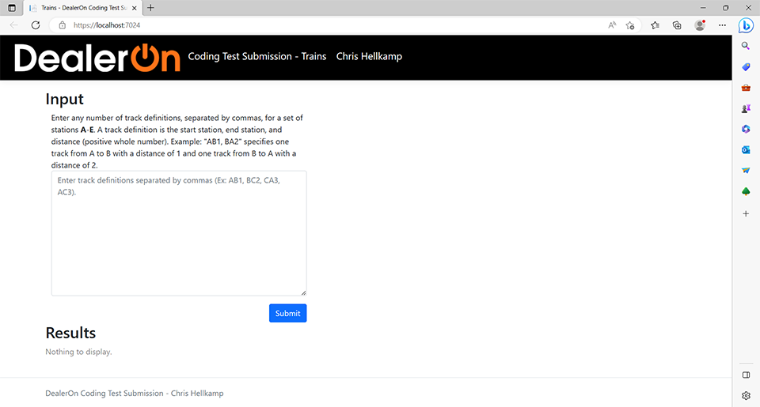

# DealerOn Coding Test Submission - Trains
*Candidate: Christopher Hellkamp*

This Visual Studio solution contains Chris Hellkamp's submission for the *Trains* problem in the DealerOn coding test.

For reference, the full problem description can be found [here](docs/Development_Candidate_Coding_Test_v5_20210218.pdf),
under "Problem Three" on page 4.

## Problem Description
The following problem statement is taken verbatim from the coding test.

You have been tasked to help the Kiwiland railroad provide information about its routes to its customers, in particular:
- route distance,
- number of unique routes between two towns, and
- the shortest route between two towns.

In Kiwiland, all train routes are one-way, and round trip routes may or may not exist. For example, just because there is a route
from town A to B does not mean there is necessarily a route from B to A. In fact, if both routes happen to exist, each
route should be considered unique (and may even have different distances)!
Use a directed graph to represent the train routes. A node represents a town and an edge represents a route between
two towns. The edge weight represents route distance. No route appears more than once in the input, and for any
given route, the starting and ending town will never be the same town (e.g., there are no routes from A to A).

**INPUT**
For the test input, the towns are named using the first few letters of the alphabet
from A to E. A route between two towns A to B with a distance of 5 is represented
as AB5.

**OUTPUT**
Given the test inputs, calculate the following:
1. The distance of the route A-B-C.
2. The distance of the route A-D.
3. The distance of the route A-D-C.
4. The distance of the route A-E-B-C-D.
5. The distance of the route A-E-D.
6. The number of trips starting at C and ending at C with a maximum of 3
stops. In the test input, there are two such trips: C-D-C (2 stops). and C-E-B-C
(3 stops).
7. The number of trips starting at A and ending at C with exactly 4 stops. In the
test input, there are three such trips: A to C (via B,C,D); A to C (via D,C,D); and
A to C (via D,E,B).
8. The length of the shortest route (in terms of distance to travel) from A to C.
9. The length of the shortest route (in terms of distance to travel) from B to B.
10. The number of different routes from C to C with a distance of less than 30. In
the test input, the trips are: CDC, CEBC, CEBCDC, CDCEBC, CDEBC, CEBCEBC,
CEBCEBCEBC.

For items 1 through 5, if no such route exists, output ‘NO SUCH ROUTE’.
Otherwise, follow the route as given; do not make any extra stops!

**EXAMPLE**
*Test Input*
>AB5, BC4, CD8, DC8, DE6,
>AD5, CE2, EB3, AE7

*Expected Output*
>Output #1: 9
>Output #2: 5
>Output #3: 13
>Output #4: 22
>Output #5: NO SUCH ROUTE
>Output #6: 2
>Output #7: 3
>Output #8: 9
>Output #9: 9
>Output #10: 7

## Implementation

This solution consists of 3 projects:
1. ***WebApp*** - *Startup Project.*  This ASP.NET project consists of a shallow web interface, shown in the image above.  In the **Input** textarea, the user may enter a comma-delimited list of track specifiers, as layed out in the original problem description (Ex: Type "AB2" for a track from A to B of length 2), press the *Submit* button, and watch the **Results** section populate with a table of the 10 oddly-specific outputs requested in the problem statement, with a description of each output.  If there's an error, a red error message will appear below the input textarea.
The display uses Bootstrap for styling.  Vue and Axios are used to update the display in an effort to demonstrate that, while this developer has no prior experience with Vue and has
been honest about his level of experience with it, he has the ability to learn and adapt to meet DealerOn's needs.

2. ***TrainsLib*** - Library project, in C#.  Contains the majority of the problem-solving code.  It has utilities to parse user input(InputParser.cs), and define and perform operations on a directed graph of train tracks(TrackGraph.cs).  In a larger problem space, these functions would likely be separated out into different libraries.  Here, the main goal of the library was to keep the problem-solving logic separate from the display.  That way, other kinds of user interfaces - such as a simple console or desktop application - would be easier to create, if needed.

3.  ***TrainsLibTest*** - Unit test project.  Contains unit tests for the utilities in the *TrainsLib* project.

## Assumptions

Some assumptions made during the design and implementation:
- The set of stations in the graph available to the user is always A-E.  Station letters may be case insensitive.
- All distances are specified as integer numbers.  A track length of 0 is invalid.
- A track that loops (A to A) can exist.  We call this the *very scenic* route.
- For any two stations X and Y, there can be at most one track that goes nonstop from X to Y.  If the user specifies 2 or more tracks with the same start and end ("...AB2, AB3..."), the LAST one to be entered ("AB3") will be the one that exists in the graph.
- Minimum desired input would be a text field that simply accepts the sample format shown in the problem description slides.
- The 10 lines of output asked for in the problem statement are the same 10 questions that will be asked of EVERY graph the user defines.
- A web-based display would be a good idea given the nature of the position applied for, but is also not part of the stated requirements.  Making an overly complex display is not recommended.
 
## Possible Improvements
We know what happens if you give an infinite number of monkeys an infinite number of typewriters, but what if this particular code monkey had an infinite amount of time and resources to keep going?  What are some future improvements we might see?
- Multiple interface applications:  There could be a version of this app for consoles.  There could be another version in the form of a desktop app with a WPF-based display and an MVVM pattern behind it.
- Accept other forms of input to define the graph:  a file upload button that allows the user to specify input from a text file, graphical controls that allow the user to define each edge of the track graph by selecting the stations from a list and entering the distance into a text field.  Furthermore, we could allow the user to enter a positive floating point number for the distance instead of an integer.
- Configurable output:  Right now, the problem specification has some very specific line items it asks for in the output (Ex: "The length of the shortest route (in terms of distance to travel from A to C").  It would be much more flexible to allow the user to define the stations and distance constraints they want to see in the output.  For example, the user could ask for "the length of the shortest route from D to C", "the distance of route A-A-B", and "the number of routes from E to A" with a dynamic enough user interface.
- Why limit our user to just 5 stations?  If we insist on using single letters as station identifiers, we could still allow A-Z, provided performance will allow it. The *TrackGraph* class already allows this.  Our *InputParser* does not.
- Improved error reporting:  Our error reporting is very quick and dirty for this application.  Right now, we just pass the exception message along directly to the error label.  This is NOT accepted practice.  Specific errors should be logged on the back end and more generic messages reported to the user.
- Cleanup:  The ASP.NET project, in particular, came with a lot of boilerplate code and files that aren't necessary for such a small project. The Microsoft-provided project template is great for getting something up in a hurry, but we'd want to look for files that can be removed and HTML that can be simplified.
- Theming:  The ASP.NET project uses the default Bootstrap theme.  As long as we're using DealerOn's logo, then it makes sense to at least change the primary color from blue to orange so we more closely match the theme on the company's home page.  As this involves removing the default Bootstrap files and rebuilding them with SASS, this developer decided this to be a bit too far out of scope for the time being.
